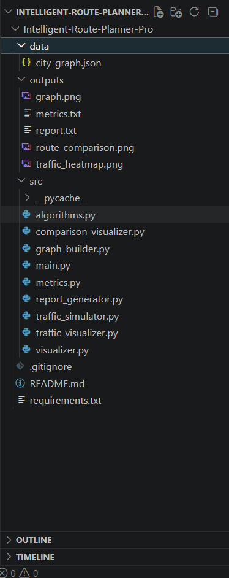
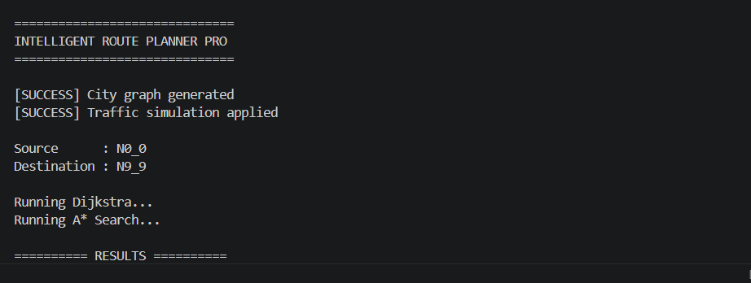
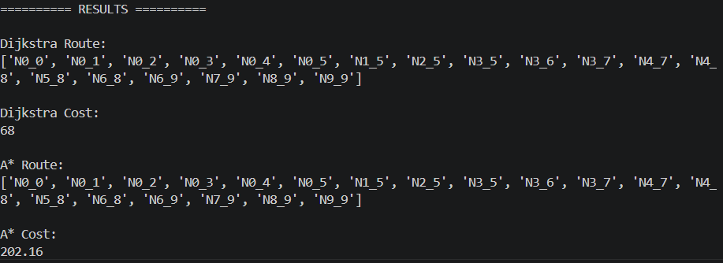
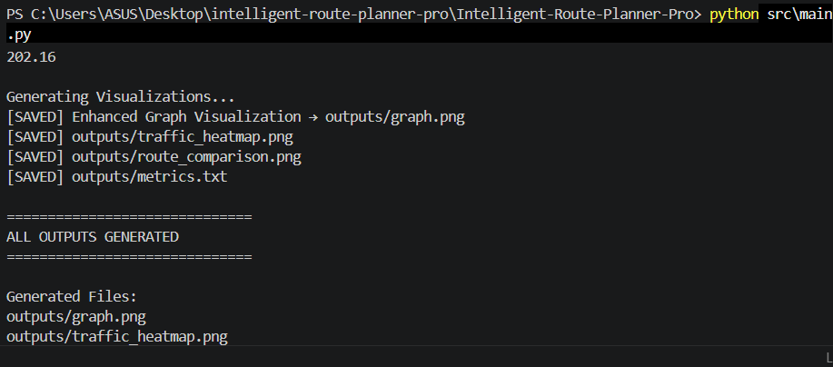
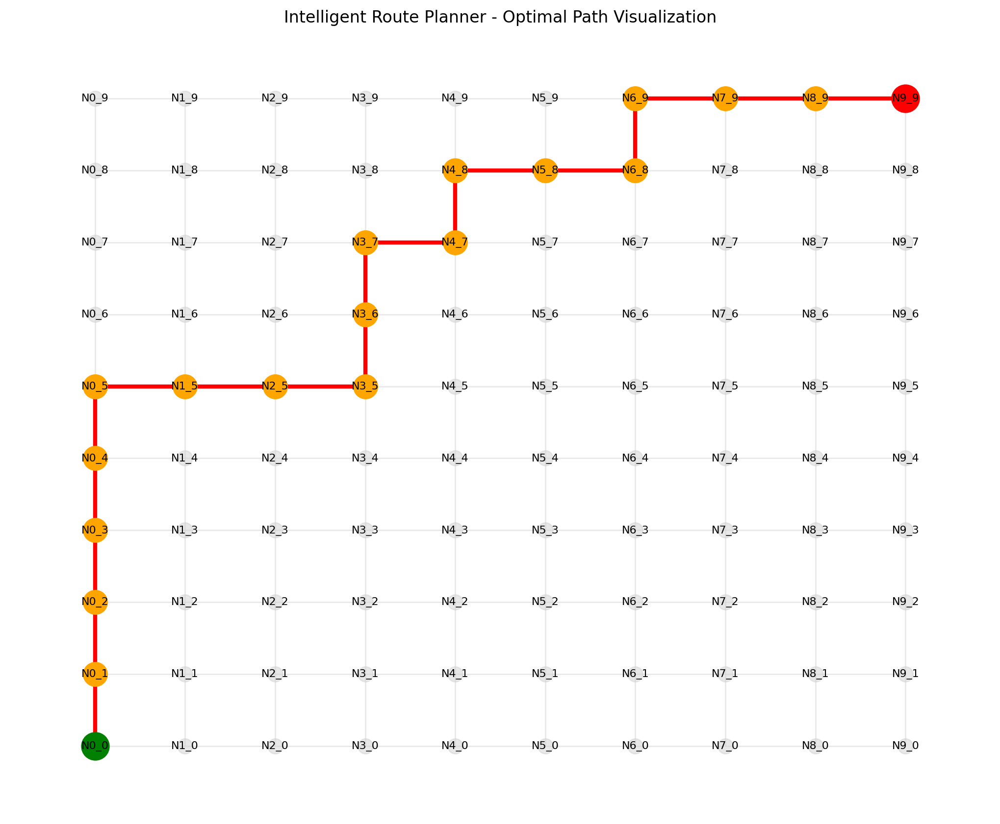
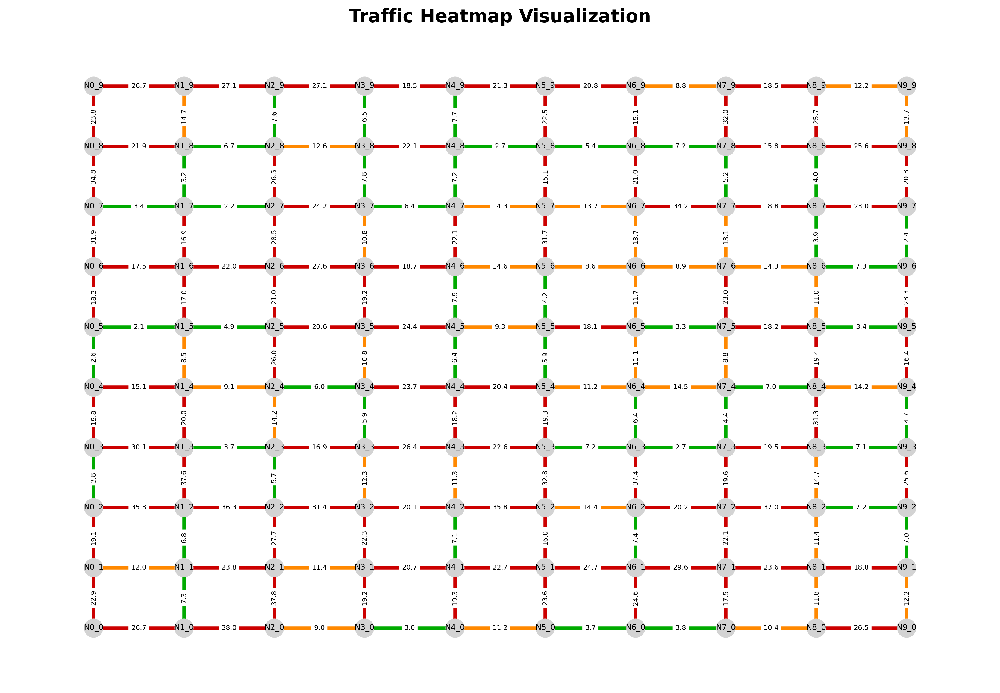
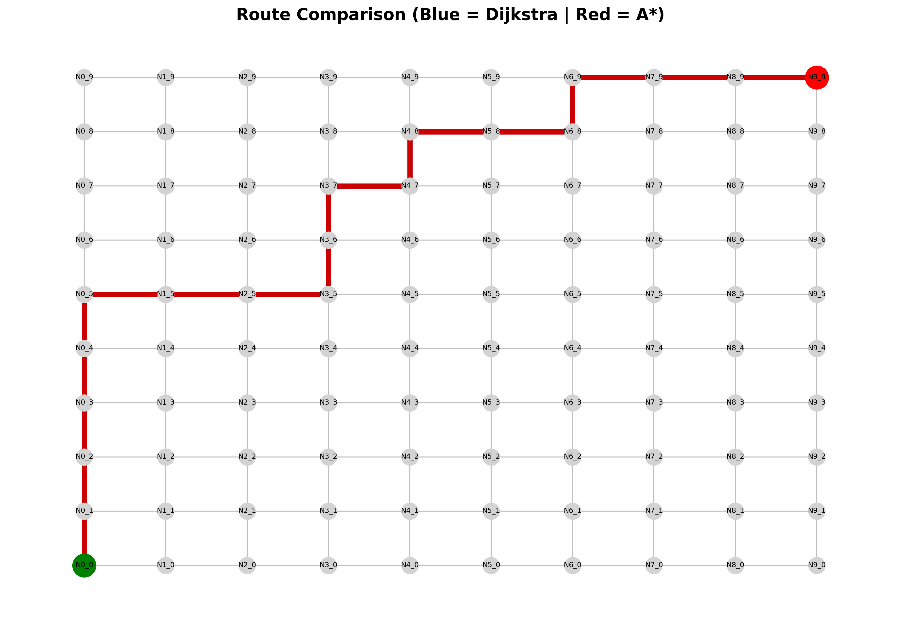
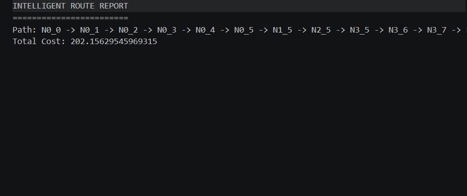
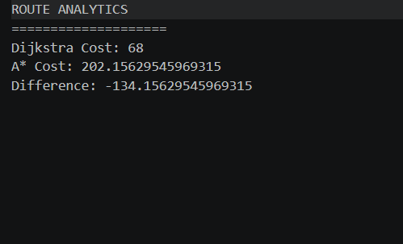

# 🚀 Intelligent Route Planner Pro

[](https://github.com/vyawaha/intelligent-route-planner-pro)

[](https://www.python.org/)
[](https://github.com/vyawaha/intelligent-route-planner-pro)
[](https://github.com/vyawaha/intelligent-route-planner-pro)


### 🔗 Repository
https://github.com/vyawaha/intelligent-route-planner-pro.git

---

## 📌 Overview

Intelligent Route Planner Pro is an advanced graph-based route optimization system that simulates real-world navigation engines used by logistics companies, ride-hailing platforms, and mapping services.

The project models a city as a weighted graph and computes optimal routes using classical graph algorithms such as Dijkstra and A* Search while incorporating simulated traffic conditions and route analytics.

---

## 🎯 Problem Statement

Modern transportation systems require intelligent routing decisions that balance travel time, distance, and traffic conditions.

This project demonstrates how graph algorithms can be used to:

* Find shortest routes
* Simulate traffic congestion
* Compare routing algorithms
* Generate route analytics
* Visualize transportation networks

---

## 🧠 DSA Concepts Used

### Graphs

Locations are represented as nodes and roads are represented as weighted edges.

### Adjacency List Representation

Efficient storage of road networks.

### Priority Queue (Min Heap)

Used by Dijkstra and A*.

### Dijkstra Algorithm

Computes shortest-distance routes.

### A* Search Algorithm

Computes optimized routes using heuristics.

### Path Reconstruction

Generates complete route sequences.

---

## ⚙ Features

* City graph generation
* Dynamic traffic simulation
* Dijkstra shortest path routing
* A* route optimization
* Traffic heatmap generation
* Route comparison visualization
* Route analytics reports
* Automatic image generation
* Modular architecture

---

## 📂 Project Structure

```text
Intelligent-Route-Planner-Pro/
│
├── data/
├── outputs/
├── screenshots/
├── src/
│   ├── graph_builder.py
│   ├── algorithms.py
│   ├── traffic_simulator.py
│   ├── visualizer.py
│   ├── traffic_visualizer.py
│   ├── comparison_visualizer.py
│   ├── metrics.py
│   ├── report_generator.py
│   └── main.py
│
├── README.md
├── requirements.txt
└── .gitignore
```

---

## ▶ Installation

```bash
pip install -r requirements.txt
```

---

## ▶ Run

```bash
python src/main.py
```

---

## 📊 Outputs Generated

The system automatically generates:

```text
outputs/
│
├── graph.png
├── traffic_heatmap.png
├── route_comparison.png
├── report.txt
└── metrics.txt
```

---

## 🖼 Screenshots

### Project Structure



### Terminal Execution







### Route Visualization



### Traffic Heatmap



### Route Comparison



### Route Report



### Metrics Report



---

## 📈 Sample Analytics

| Metric           | Value                     |
| ---------------- | ------------------------- |
| Algorithm 1      | Dijkstra                  |
| Algorithm 2      | A* Search                 |
| Graph Type       | Weighted Undirected Graph |
| Routing Strategy | Shortest Path             |
| Traffic Model    | Dynamic Edge Weights      |

---

## 🌍 Real-World Applications

* Google Maps style routing
* Ride-hailing platforms
* Food delivery systems
* Logistics optimization
* Smart transportation systems
* Campus navigation systems

---

## 📚 Learning Outcomes

Through this project I learned:

* Graph modeling
* Route optimization
* Dijkstra Algorithm
* A* Search
* Heuristic-based routing
* Network visualization
* Traffic simulation
* Software modularization
* Python project architecture

---

## 🔮 Future Enhancements

* Real OpenStreetMap integration
* EV route planning
* Time-dependent traffic prediction
* Multi-objective optimization
* Alternative route recommendation
* K-shortest path algorithms

---

## 👨‍💻 Author

**Muktai Vyawahare**

GitHub:
https://github.com/vyawaha

Project Repository:
https://github.com/vyawaha/intelligent-route-planner-pro

Developed as an advanced Data Structures & Algorithms project demonstrating graph algorithms, shortest path optimization, traffic simulation, and route visualization.